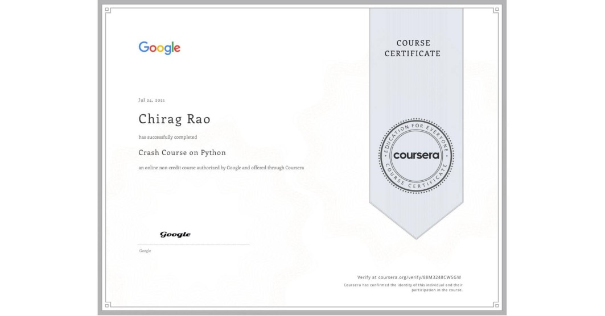
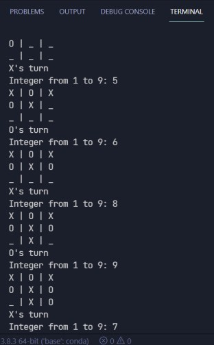
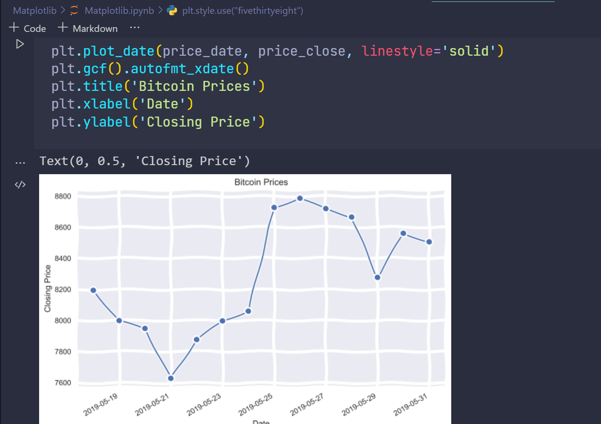
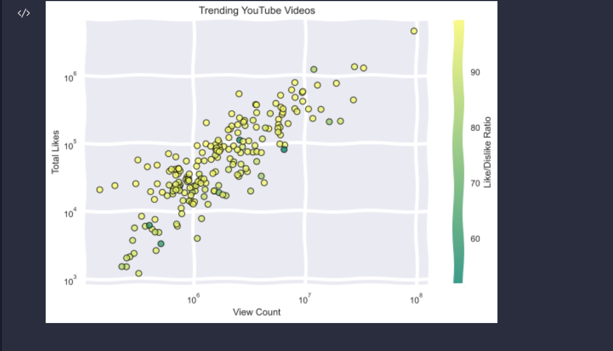
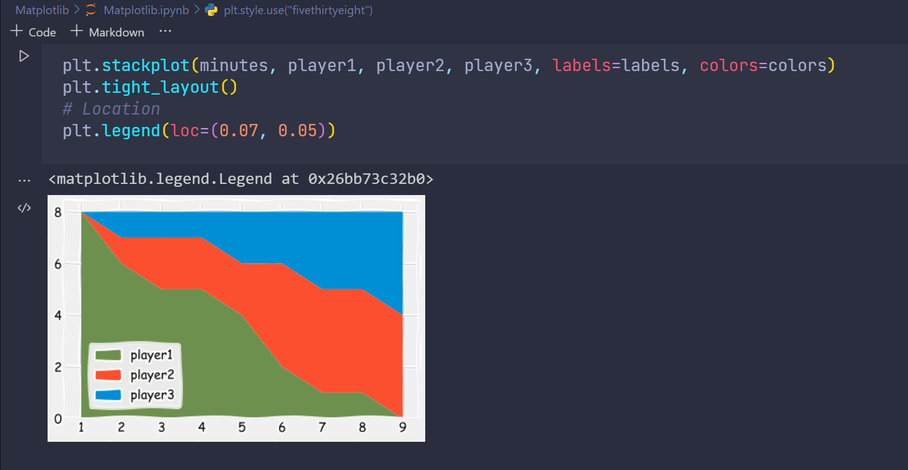
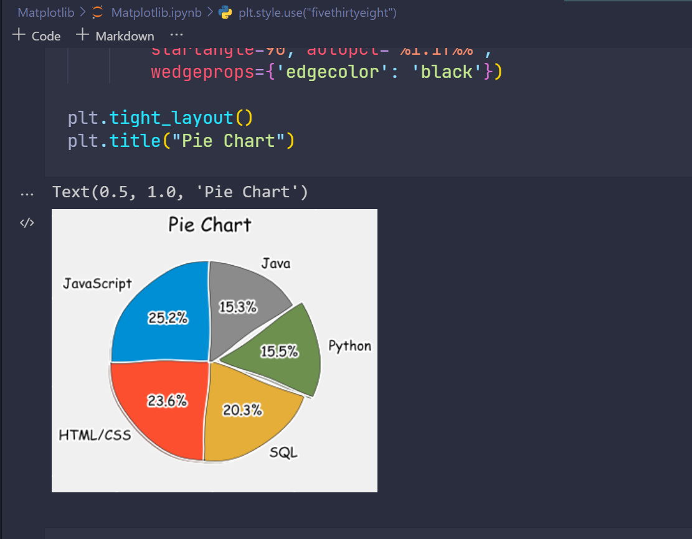
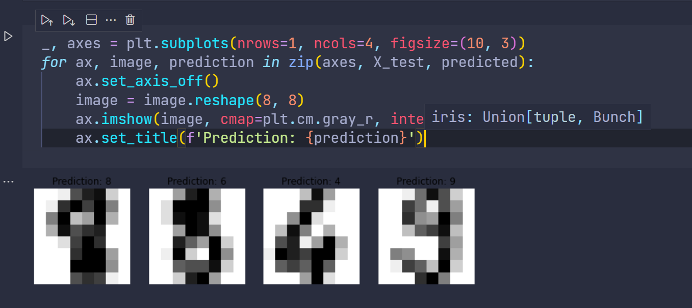
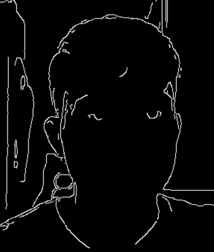
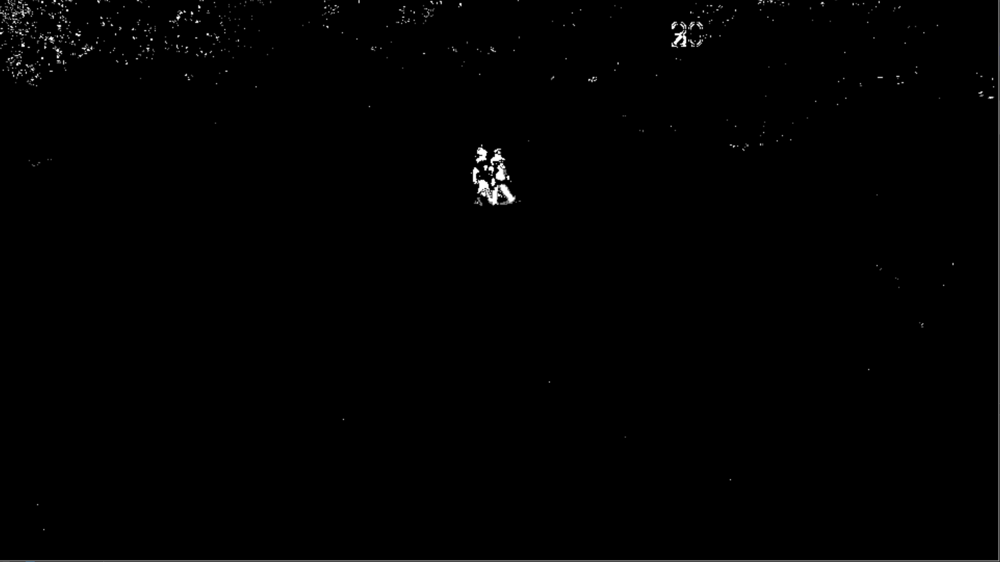

# Vision-AI-Taskphase

## **TASK 1**
- Complete The Crash Course on Python Course on Coursera
- Make 2 games, made TicTacToe and Snake
- Documented the Project

## COURSE

This task started off with the Crash Course on Python course on Coursera. As I already had some experience in Python, it wasn't too hard. The OOP section taught me some new and exciting concepts.
Loops, functions, iterables, basic data structures, were all covered.

I had to implement a word-cloud project as the final proejct. The jupyter notebook is here in this folder. The project required use of some python concepts and some knowledge about dictionaries. I made a word cloud using the Great Expectations Book on Project Gutenberg.

I used a pip package called word-cloud to create the cloud. I also used matplotlib to plot the cloud. It just generates a word cloud based on frequencies of words, excluding the stop-words or uninteresting words.

> Link for certificate - https://www.coursera.org/account/accomplishments/verify/88M3248CW5GW?utm_source=link&utm_medium=certificate&utm_content=cert_image&utm_campaign=sharing_cta&utm_product=course

## GAMES

### GAME-1

I implemented Tic-Tac-Toe in vanilla Python using the command-line-interface. It is modular and is broken down into many functions, which is easy to understand. It also has many comments.

Sources - Youtube References, Stack Overflow for some custom functions.

### GAME-2

I also implemented the snake game in Python. I used Pygame 2.0.0 for this. This program is also modular, well commented and easy to understand.

Sources:

> For the score and end_game function: https://stackoverflow.com/questions/20842801/how-to-display-text-in-pygame

> For inspiration - Used some inspiration from the web and various forums on the implementation of Snake in Python.

## **TASK 2**

## PREREQUISITES:

1.  I spent some time learning the basics and intermediate concepts of numpy and Pandas, for data analysis and machine Learning. In numpy I learn all about arrays, their dynamic nature in Python and how numpy is a powerful tool for working with arrays and matrices.
2.  Pandas is one of the most useful libraries for working with tabular data in Series or in Dataframes. It is a very handy wrapper package to work with csv's and find hidden insights in data using various techniques like null-filtering, aggregration, special tables, basic data plotting and so much more.

## MATPLOTLIB

**https://youtube.com/playlist?list=PL-osiE80TeTvipOqomVEeZ1HRrcEvtZB_**

## **BitCoin Prices**

## **Trending Youtube Videos**

1.  Matplotlib is the most famous and most versatile data plotting library for python. It plots beautiful graphs based on custom data.
2.  I learnt about plotting line charts, pie charts, adding annotations to pie charts, scatter plots, bubble plots, bar plots.
3.  I also learnt about various other 2d plots like area charts, stackplots, axis lines
4.  Using matplotlib's parameters inside a function really changes the look of the chart and plot. It has various paramters like interpolation, built in logic functions, styling params
5.  Matplotlib also has a wide array of styles to work with, which increases the user appeal.
6.  I plotted various charts based on Average Salaries, Language specific developer salaries, random data, youtube api data, bitcoin prices plots.
7.  One of the most fun things to work with was Live data fed from an API or another source. I used matplotlib's FuncAnimation method to acheive this.

## **Stack Plot**

## **Pie Charts**

## Sci-Kit Learn

**https://www.youtube.com/watch?v=pqNCD_5r0IU**

1. In SKlearn, I explored various machine learning models and algorithms and what goes on behind the scenes. I also learnt how to display images using matplotlib using imshow. The machine learning models I experimented with were:

   - Linear regression
   - Logistic Regression
   - Multilayer Perceptron Model
   - K Means Clustering

2. I also dived deeper into learning about activation functions, basics of neural nets, optimization of models, hyper-parameter optimization, gradient descent and cost functions.

3. I learnt about various metrics of calculating the efficieny of the model, including:
   - coefficients
   - accuracy score
   - intercept score
   - confusion matrix and classification report
4. I got my hands dirty with some projects like classifying hand-written digits, predicting whether the case of breast cancer is malignant or benign, predicting prices of houses in Boston and finally working with the IRIS dataset to classify iris flowers into 3 categories.

## OpenCV

### **https://youtube.com/playlist?list=PLQVvvaa0QuDdttJXlLtAJxJetJcqmqlQq**

## **Canny Edge Detection**

## **Feature Matching**

1. I followed a playlist for OpenCV from the youtube channel Sentdex and the website [pythonprogramming.net](https://pythonprogramming.net/).
2. I learnt about various concepts in OpenCV like:
   - Introduction and Working with Images and HSV Image formats.
   - Loading a video source
   - Drawing and writing on images
   - Various Image Operations of OpenCV
   - Image Bitwise Arithmetic
   - Thresholding of images
   - Color Filtering
   - Blurring and Smoothing Images
   - Morphology Operations on Images
   - Canny Edge Detection, Lapacian Gradients, Sobel Operators
   - Template Matching, Feature Matching Using Brute Force
   - Grabcut Foreground
   - Corner Detection using GoodFeaturesToTrack
   - MOG Background Subtraction
   - Working with Haar Cascade Files
   - Detection of Faces, Eyes and Smiles

## **MOG Background Subtractor**

### _Whew, that was quite an exhaustive list_

## **TASK-3**

I completed 4 courses in the Deep Learning Specialization. I learnt a lot from this specialization and also acquired new skills and tips on being a deep learning practioner. 

### COURSE-1

I learnt about Logistic Regression and basics of Neural Networks and the math behind it. I also learnt to create and train a neural network from scratch, due to the comprehensive notebook assignments provided.

### COURSE-2

I learnt about various optimizaition techniques, regularization, over and under fitting, random initialization and Gradient Checking. I also implemented all of these from scratch.

### COURSE-3

This course was a short one, and I acquired various best skills and practices for organizing Deep Learning data and performing Error Analysis as smoothly as possible. I learnt about the various splits, organizing the splits, data mismatch and much more

### COURSE-5

This course was really fun. I messed around with Sequence Data, and trained RNN's, LSTM's and GRU's from scratch. I also generated by own Jazz music and created Dinosaur names I also learnt about word embeddings, positional encodings, transformer model, attention and trigger word detection using tensorflow API. All in all, this course took the longest amount of time to complete, but was worth the effort I put in.
