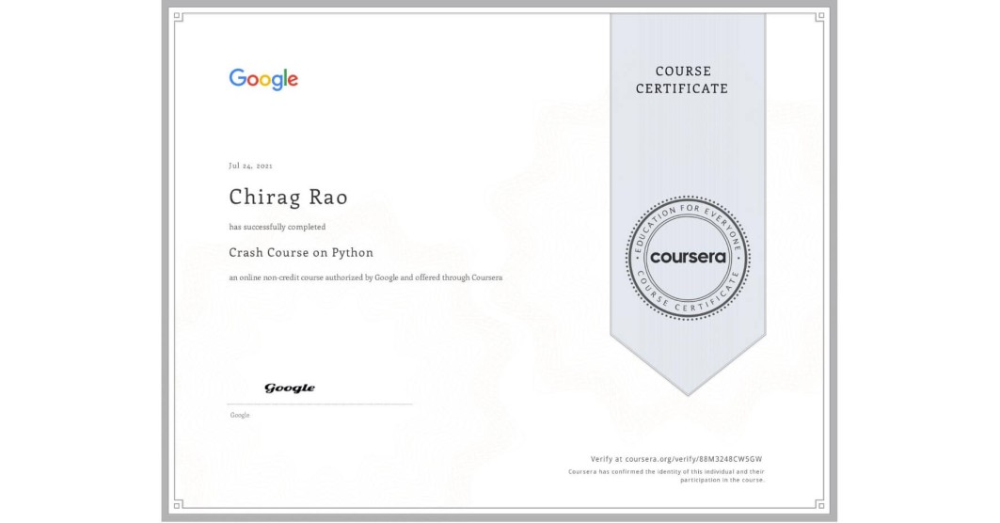
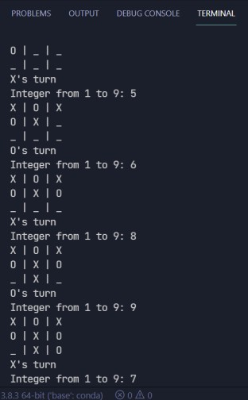
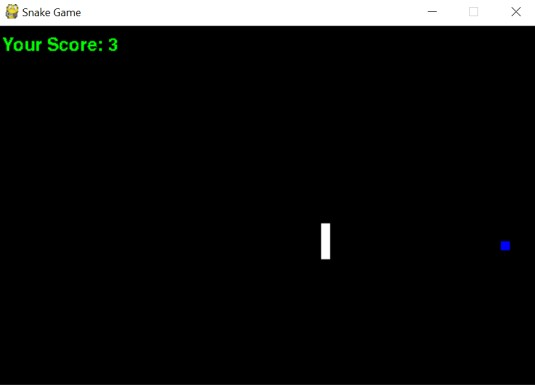

# Vision-AI-Taskphase

## **TASK 1**
- Complete The Crash Course on Python Course on Coursera
- Make 2 games, made TicTacToe and Snake
- Documented the Project

## COURSE

This task started off with the Crash Course on Python course on Coursera. As I already had some experience in Python, it wasn't too hard. The OOP section taught me some new and exciting concepts.
Loops, functions, iterables, basic data structures, were all covered.

I had to implement a word-cloud project as the final proejct. The jupyter notebook is here in this folder. The project required use of some python concepts and some knowledge about dictionaries. I made a word cloud using the Great Expectations Book on Project Gutenberg.

I used a pip package called word-cloud to create the cloud. I also used matplotlib to plot the cloud. It just generates a word cloud based on frequencies of words, excluding the stop-words or uninteresting words.

> Link for certificate - https://www.coursera.org/account/accomplishments/verify/88M3248CW5GW?utm_source=link&utm_medium=certificate&utm_content=cert_image&utm_campaign=sharing_cta&utm_product=course

## GAMES

### GAME-1

I implemented Tic-Tac-Toe in vanilla Python using the command-line-interface. It is modular and is broken down into many functions, which is easy to understand. It also has many comments.

Sources - Youtube Resources, Stack Overflow for some custom functions.

### GAME-2

I also implemented the snake game in Python. I used Pygame 2.0.0 for this. This program is also modular, well commented and easy to understand.

Sources:

> For the score and end_game function: https://stackoverflow.com/questions/20842801/how-to-display-text-in-pygame

> For inspiration - # TASK 1

## COURSE

This task started off with the Crash Course on Python course on Coursera. As I already had some experience in Python, it wasn't too hard. The OOP section taught me some new and exciting concepts.
Loops, functions, iterables, basic data structures, were all covered.

I had to implement a word-cloud project as the final proejct. The jupyter notebook is here in this folder. The project required use of some python concepts and some knowledge about dictionaries. I made a word cloud using the Great Expectations Book on Project Gutenberg.

I used a pip package called word-cloud to create the cloud. I also used matplotlib to plot the cloud. It just generates a word cloud based on frequencies of words, excluding the stop-words or uninteresting words.

> Link for certificate - https://www.coursera.org/account/accomplishments/verify/88M3248CW5GW?utm_source=link&utm_medium=certificate&utm_content=cert_image&utm_campaign=sharing_cta&utm_product=course

## GAMES

### GAME-1

I implemented Tic-Tac-Toe in vanilla Python using the command-line-interface. It is modular and is broken down into many functions, which is easy to understand. It also has many comments.

Sources - https://youtu.be/BHh654_7Cmw, Stack Overflow for some custom functions.

### GAME-2

I also implemented the snake game in Python. I used Pygame 2.0.0 for this. This program is also modular, well commented and easy to understand.

Sources:

> For the score and end_game function: https://stackoverflow.com/questions/20842801/how-to-display-text-in-pygame

> For inspiration - Used some inspiration from the web and various forums on the implementation of Snake in Python.
